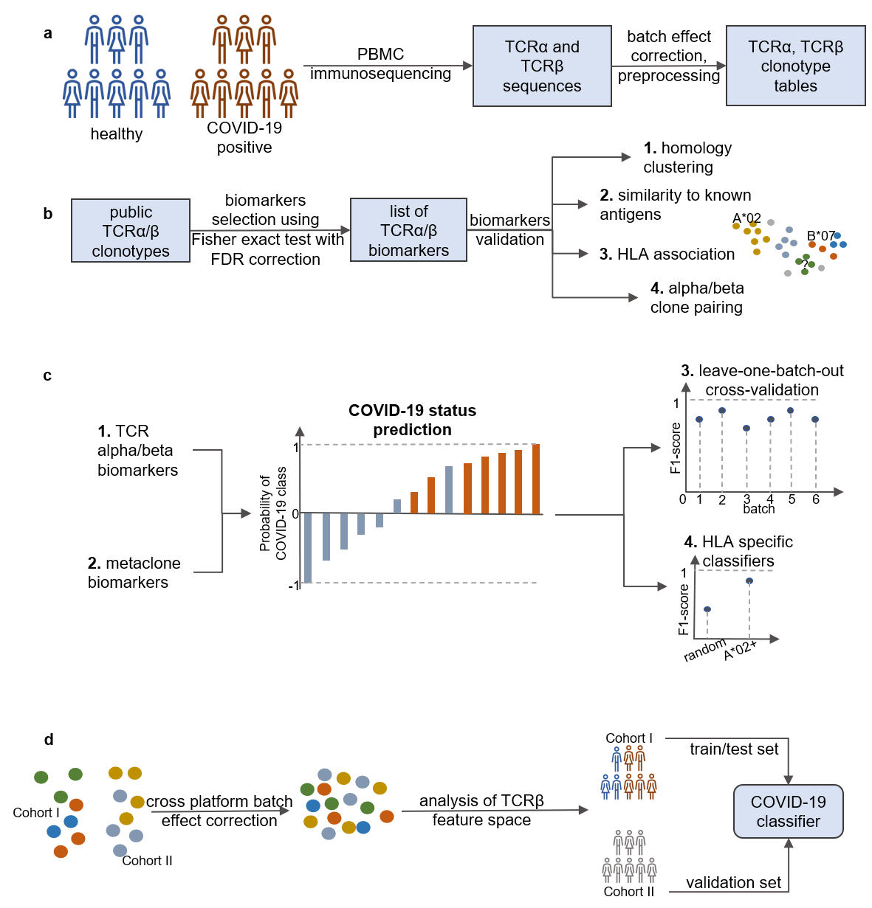

# TCR alpha and beta based classifier for COVID-19 status prediction
The repository contains code for article "Predicting SARS-CoV-2 exposure using T-cell 
repertoire sequencing and machine learning".
The overall pipeline is shown below: 

The main results and its vizualization can be found [here](https://covidbiomarkers.cdr3.net/).
## Data availability
All the data used in this research was uploaded to [Zenodo platform](https://zenodo.org/records/8362803).
## MetaClone classifier
### Prerequisites
We expect that you have an access to a cluster with at least 
* 24 threads 
* 16gb RAM 

You need to have Python, conda and snakemake installed to run the code.
We use OLGA software for TCR generation probability calculations.

### Installation
1. `git clone https://github.com/antigenomics/tcr-covid-classifier.git`
2. `conda env create -f environment.yml`
3. `conda activate tcr-classifier`
4. `pip install logomaker openpyxl`

### Run the whole pipeline
The code is organized into a snakemake pipeline.
You need to run the following command from the root directory:
```cmd
snakemake --cores 48 
```
You can specify less cores, but the code would be requiring more time to execute.
Using 16gb RAM and 48 CPUs the code is expected to run for ~12 hours.  

### TCR biomarkers search
The biomarkers search is implemented in ``source/tests_analysis/covid_test_250k.py``. 
You will need to prepare the data firstly. Data preparation includes the following steps:
1. Segment usage matrix creation (``source/v)j_usage_matrix_creation.py``)
2. Usage matrix standardization if data was prepared in more than one batch (`source/usage_matrix_preprocessing.py`)
3. Data resampling (`source/downsampling_procedure`) which is required in case when step 2 was used
4. Public clones extraction and clone matrix creation (`source/clonotypes_extraction_procedure.py` and `source/clonotype_matrix_creation.py`)

### Evaluation of found biomarkers
The biomarkers are analyzed on how they can be clustered together within one amino acid change. In addition to that we 
implemented a pipeline to search for associations of the found clusters in VDJdb. 
This analysis is performed in ``publication-notebooks/fig2.ipynb``.

You can try the analysis yourself by browsing our [website](https://covidbiomarkers.cdr3.net/).

### Classification
The classification pipeline includes cross-validation between batches of data and comparing different models.
The more precise description of the analysis performed can be found in ``publication-notebooks/fig4.ipynb`` and 
`publication-notebooks/fig5.ipynb` (for classification between data derived with different platforms).

### HLA specific biomarkers search increases classification quality
The analysis of A\*02 classification quality vs all HLA data can be found in ``publication-notebooks/fig6.ipynb``. 
The analysis of rare HLA pattern found for DRB1\*16 and DQB1\*05 positive donors is located in ``publication-notebooks/fig4.ipynb`` 

##Working with docker images

### Building your image
Run this in the directory with Dockerfile

`docker build  -t [your image tag] .`

### Running docker container
Run anywhere

`docker run -i -p 5000:5000 [your image tag] -d`

### Pushing to docker hub 

CHECK CREDENTIALS IN DOCKER DESKTOP

`docker tag [your build tag] lizzka239/[your build tag]:latest`

`docker push lizzka239/[your build tag]:latest`